<h1 align="center">Oceanographic Data Analysis</h1>

## Project 1: Temperture and Salinity Analysis based on Location, Season and Depth

### Aim:
This study analysises oceanographic data, with a particular focus on temperature and salinity variables across different latitudes, longitudes, depths, and seasons using Python as an analytical tool. The primary aim is to unveil the intricate patterns of temperature and salinity across the world's oceans.

### Datasets:

1. **[World Ocean Atlas Dataset](https://www.kaggle.com/datasets/madhushreesannigrahi/ocean-data)**
    
    This dataset offers detailed temperature and salinity readings for major oceans across latitudes and longitudes, with depths reaching 1400 meters throughout the year 2020. (Stored in .CDF format)

2. **[Copernicus Dataset](https://www.kaggle.com/datasets/madhushreesannigrahi/oceanography-copernicus-data/data?select=mercatorglorys12v1_gl12_mean_202001.nc)**

    This is the official Copernicus Dataset of the year 2020. It contains all the informations, including temperature and Salinity, of almost all the latitudes and longitudes of the world. It is one of the benchmark datasets used for oceanographic analysis.

### Oceanographic Data Analysis:

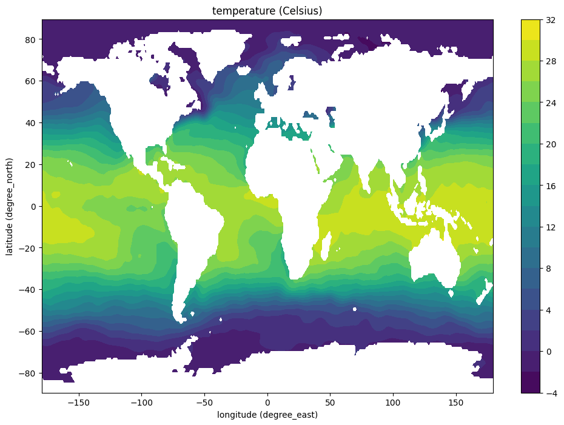

Sea Surface Temperature during January

Sea surface temperature (SST), crucial for ocean and climate dynamics, varies dramatically as we move from earth centre to the poles. Tropics, bathed in more sunlight, boast warmer SSTs compared to frigid polar regions. Yet, currents act as Earth's internal thermostat, carrying tropical warmth towards cooler poles. 

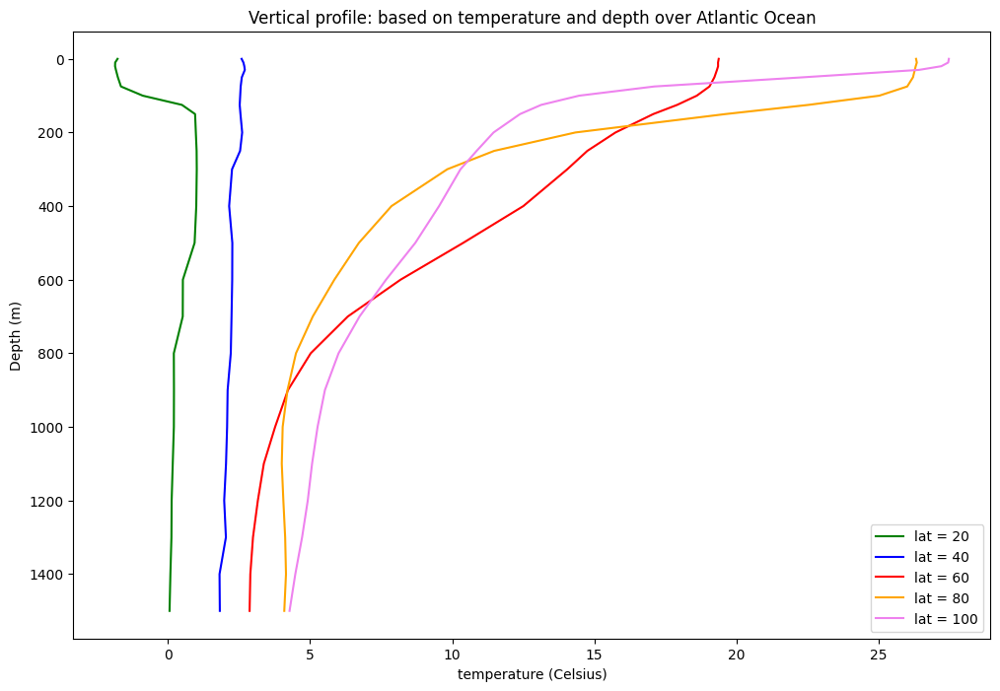

Vertical Profile of temperature along various depths during July

Ocean temperature dives with depth, shown in the above figure. The warmest surface layer (100-200m) absorbs sunlight and floats, creating stable stratification. Deeper, temperature plummets rapidly in the thermocline (100-800m), sharply transitioning from warm surface to cold depths. The thermocline's strength varies based on location and season, but generally hinders water mixing. The coldest latitudes lack a thermocline as deep waters share the chill. Beneath the thermocline, the deep ocean maintains a frigid 2-5°C due to minimal sunlight reaching these depths.

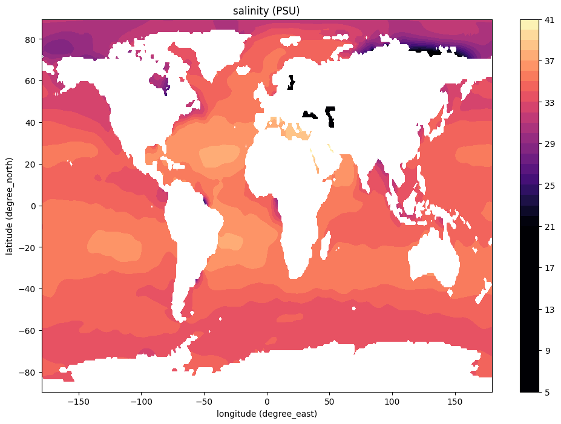

Sea Surface Salinity during January

In general, salinity is higher in the tropics and lower in the polar regions. This is because the tropics receive more sunlight, which increases evaporation rates. Evaporation leaves behind the salts that were dissolved in the water, increasing the salinity of the seawater.

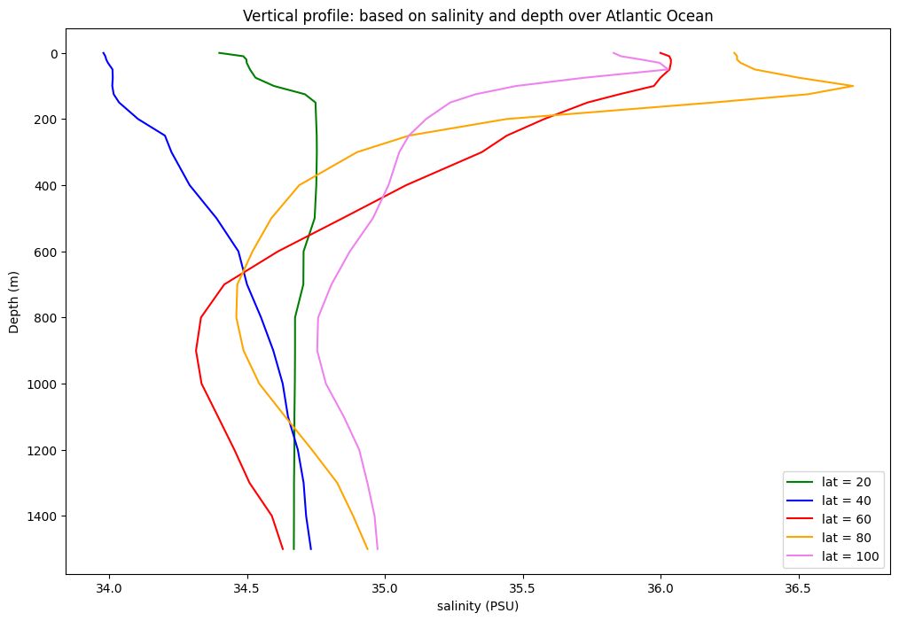

Vertical Profile of salinity along various depths during July

Ocean salinity plunges with depth. Polar surface waters boast lower salinity than the deep ocean. Conversely, warmer equatorial regions (>=60) see higher surface salinity. Below the surface, the halocline (200-500m) marks a rapid salinity increase, separating less salty surface water from saltier deeps. This arises from sinking concentrated water and freshwater mixing. The deep ocean, with limited mixing and absent freshwater input, maintains a stable 34.5-35.5 ppt salinity.

### Copernicus Data Analysis:
The temperature and salinity of the sea surface might also differ due to seasons.

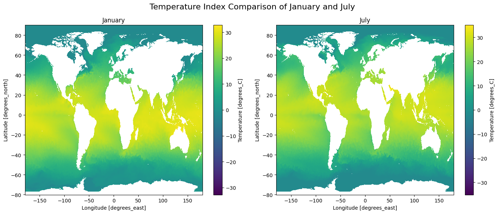

Temperature comparison of Ocean Water during January and July

July's temperature beats January's across most of the globe, as seen in index maps. This tilt-a-whirl Earth explains it: in July, the sun-soaked Northern Hemisphere basks in warmth, while the tilt-away Southern Hemisphere chills.

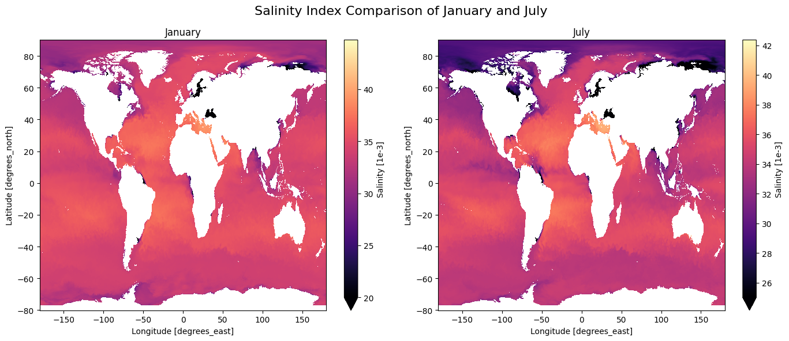

Salinity comparison of Ocean Water during January and July

The salinity index maps also show that the salinity of the ocean surface is generally higher in July than in January. This is because evaporation 
rates are higher in the summer months.

There are differences in temperature and salinity profile of different oceans at the same time of the year.

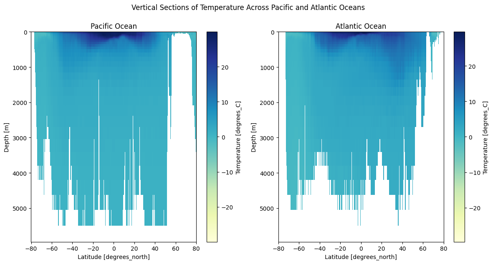

Vertical Profile of temperature along various depths during January

Pacific and Atlantic's January profile (Figure \ref{fig:verttemp}) shows a warm surface (>20°C) diving into a cooler thermocline (20-0°C) stretching down 1000m, before merging with frigid deep ocean waters.

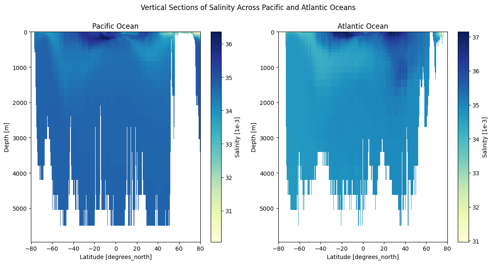

Vertical Profile of salinity along various depths during January

Arctic's salinity plummets deeper than Pacific's, revealing stronger stratification in the Arctic.

## Project 2: Temperture and Salinity Analysis on Toulon Bay

### Aim:

To collect and analyse drifter and CTD data from the Toulon Bay for its Temperature, Oxygen and Salinity Profile. 

### Group Members:
[Madhushree Sannigrahi](https://github.com/Madhushree2000),
[Abhimanyu Bhowmik](https://www.linkedin.com/in/bhowmikabhimanyu/),
[Camilla James](camilla.james123@gmail.com),
[Rameen Sheikh](https://www.linkedin.com/in/rameen-sheikh-4b21b31b5/),
[Akshat Sinha](https://www.linkedin.com/in/akshatsinha14/),
[Philopateer Akhnookh](https://www.linkedin.com/in/philopateer-akhnookh-464474229/), and 
[David Eskoundos](https://www.linkedin.com/in/david-eskoundos/) under [Prof Anne Molcard](https://www.mio.osupytheas.fr/fr/anne-molcard).

### Datasets

1. **[Drifter Data](https://drive.google.com/drive/folders/11fdkUo12ajp_rrLcKnIkSymIKGe-T8OP)**

    Drifter Data was collected on 12/10/2023 on a sea campaign in the Mediterranean Sea
    off the coast of La Seyne-sur-Mer (Toulon Bay). Surface drifters were deployed at three
    different stations.

2. **[CTD Data](https://drive.google.com/drive/folders/1TAzUEH_h9IrPnxavYGQyIJWA35qHKd0Y)**
    
    A Conductivity, Temperature and Depth (CTD) profiler was deployed at the 3 stations along with the drifters. The data contained the Temperature, Salinity and Oxygen at various depths (up till 600m)
    

### Drifter Data Analysis

The drifters were deployed at the three stations, and collected on the return trip. Velocities throughout the drifters’ trajectories ranged between 12 cm/s and 16 cm/s.
Drifters deployed earlier have more data points as they had more time to drift.

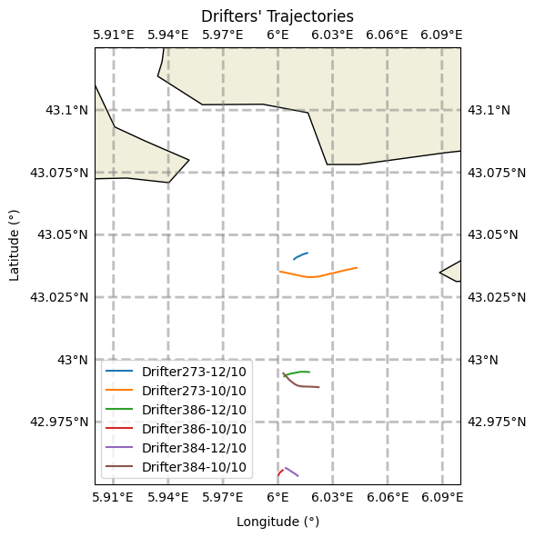

Drifters Trajectories for two days of Sea Trials

Drifters on 10/10 show a linear velocity increase across stations, suggesting strengthening current possibly driven by rising wind speed. For 12/10, Stations 2 & 3 exhibit steadily increasing velocity, implying faster wind. However, Drifter273 (recovered last & near coastline) has lower final velocity, hinting at potential wind decrease or weaker current at higher latitudes.

 

<table>
  <tr>
    <td width="50%"> 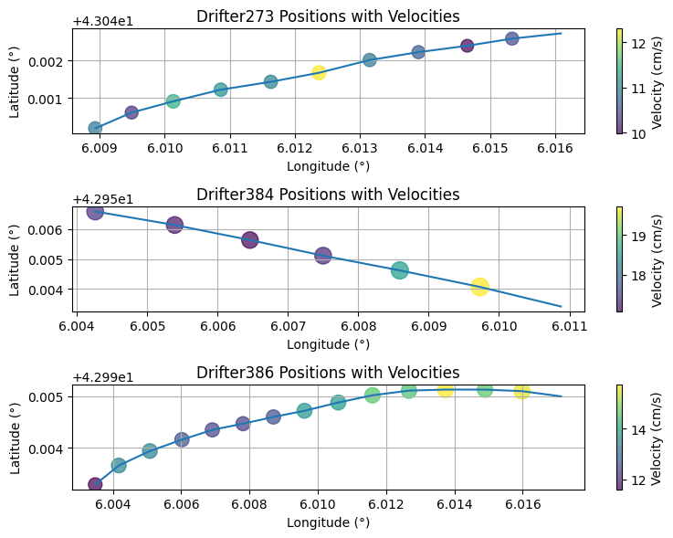 (a)12/10 </td>
    <td width="50%"> 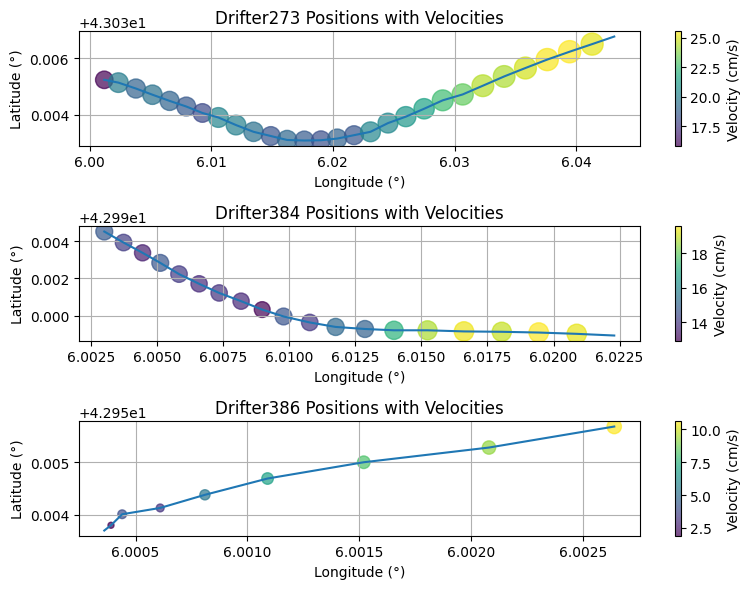 (b)10/10 </td>
  </tr>
  
Drifters' velocities over their trajectory 

</table>

### CTD Data Analysis

Figure below reveals minimal temperature variation across stations (except Station 1's shallower depth). Salinity shows more variation, with Station 2 having higher values at the halocline's end. Oxygen profiles are similar, exhibiting expected high concentration near 50m depth, suggesting possible upwelling and high biological productivity. Spatial variation had minimal impact on all profiles.

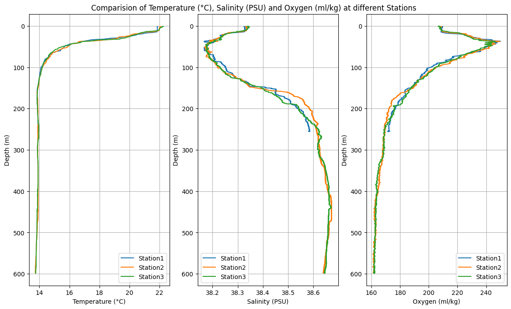

Comparing temperature, salinity and oxygen profiles for each station for day 12/10

Figure below shows clear daily variations in salinity and oxygen at Station 1 and 3, less so in temperature. Salinity on 12/10 exhibits enhanced mixing near 40m (oscillatory values), mirroring the oxygen profile. Between 70-160m, salinity on 12/10 is lower, indicating less dense water. Values converge at deeper depths, confirming surface influence diminishing with depth due to atmospheric and wind-induced effects.

<table>
  <tr>
    <td width="50%"> 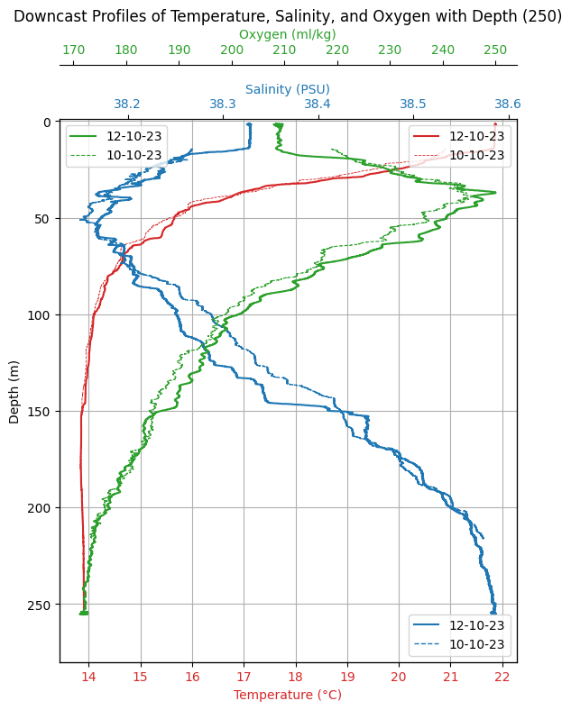 (a)Station 1 </td>
    <td width="50%"> 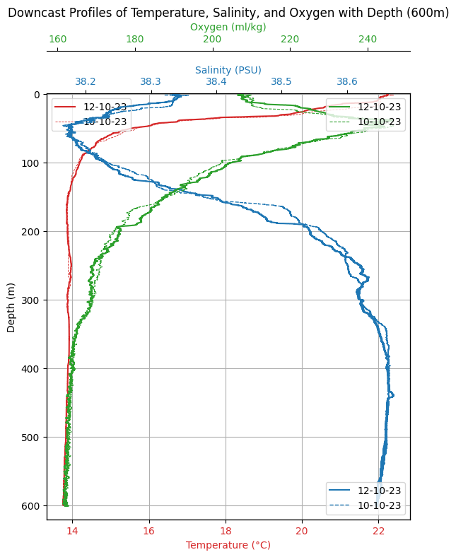 (b)Station 3 </td>
  </tr>
  
CTD profiles for 10/10 and 12/10 for Station 1 and 3 

</table>

Compared to Station 3, Station 1 exhibits greater daily variations in salinity (especially near 200m) and potentially temperature profiles. Station 3's salinity difference between days covers a shallower depth range than Station 1. This suggests Station 1 experiences stronger surface influences due to factors like wind and atmosphere.

We can conclude this CTD analysis by summarizing that:

*  There are temporal differences in the profiles. Each day has slightly different values and vertical structures. However, the general trend we expect is the same. 

* These differences are more significant for salinity and oxygen than temperature. 
    
* These differences decrease with depth, and also with location. The stations that were further away from the continent had less difference and for a shorter range of depth. 

